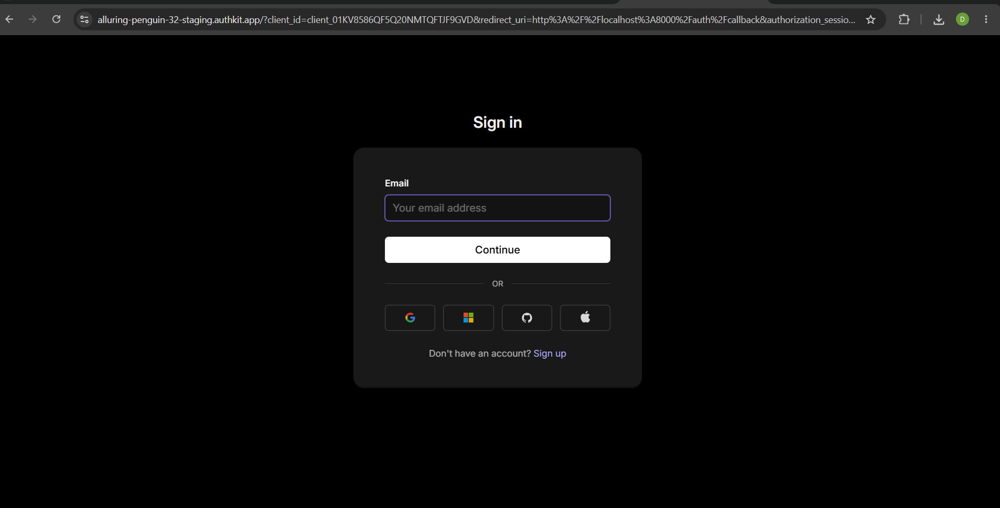
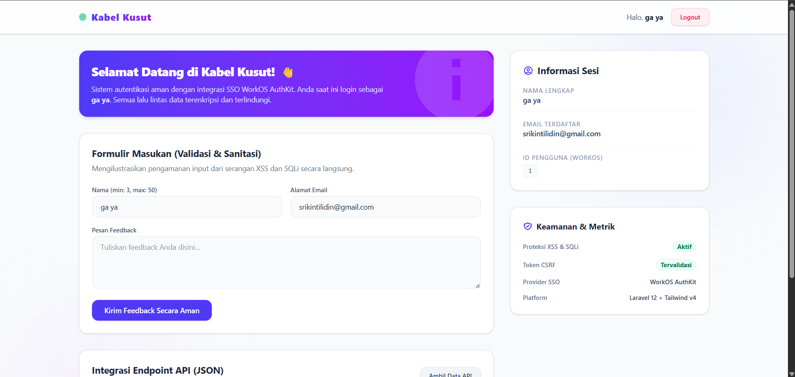
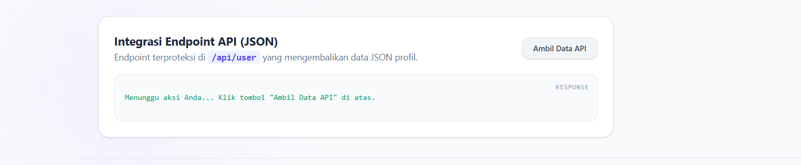
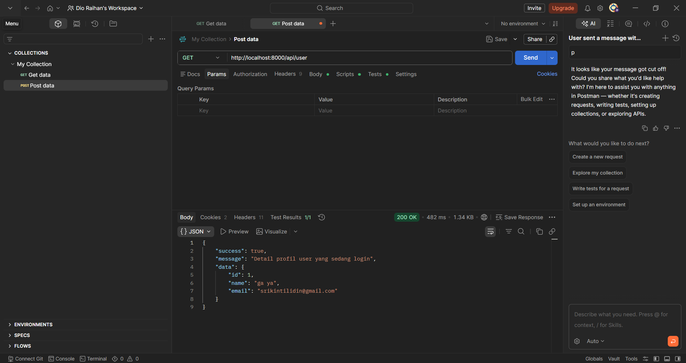

<h1 align="center">
  <big><big><big><strong>⚡ <font color="#4f46e5">Kabel</font><font color="#7c3aed">Kusut</font> ⚡</strong></big></big></big>
</h1>

<p align="center">
  Aplikasi Autentikasi Aman berbasis <strong>Laravel 12</strong> dengan integrasi <strong>WorkOS AuthKit (SSO)</strong>
</p>

---

## Tentang Aplikasi

**Kabel Kusut** adalah aplikasi web autentikasi modern yang dibangun menggunakan Laravel 12 dengan sistem Single Sign-On (SSO) melalui **WorkOS AuthKit**. Aplikasi ini dirancang untuk mendemonstrasikan praktik keamanan terbaik dalam pengembangan web, termasuk:

- **Autentikasi SSO** — Login menggunakan WorkOS OAuth 2.0 tanpa perlu registrasi manual
- **Proteksi Rute** — Middleware `auth` bawaan Laravel untuk mengamankan halaman dashboard
- **Validasi Input Ketat** — Formulir feedback dengan validasi server-side (XSS & SQLi protection)
- **API Endpoint Terproteksi** — Endpoint `/api/user` yang mengembalikan data JSON pengguna terautentikasi
- **Keamanan CSRF** — Token CSRF pada setiap formulir POST

---

## Screenshot Aplikasi

| Tampilan | Screenshot |
|----------|------------|
| **Halaman Login** |  |
| **Dashboard Pengguna** |  |
| **API Endpoint Demo** |  |
| **API Endpoint Demo Postman** |  |

---

## Fitur Utama

- ✨ **WorkOS AuthKit SSO** — Otentikasi menggunakan WorkOS OAuth 2.0 authorization code flow
- 🛡️ **Dashboard Terproteksi** — Hanya dapat diakses setelah login, menampilkan informasi sesi pengguna
- 📝 **Form Feedback Aman** — Demonstrasi validasi input dan proteksi terhadap XSS & SQL Injection
- 🔌 **API JSON** — Endpoint `/api/user` yang mengembalikan profil pengguna dalam format JSON
- 🎨 **Tampilan Modern** — Dark theme dengan Tailwind CSS, efek glassmorphism, dan gradien

---

## Tech Stack

| Komponen | Teknologi |
|----------|-----------|
| **Framework** | Laravel 12 |
| **Bahasa** | PHP 8.2+ |
| **Frontend** | Blade + Tailwind CSS + Vite |
| **Database** | mysql
| **Autentikasi** | WorkOS AuthKit (SSO / OAuth 2.0) |

---

## Cara Instalasi

Ikuti langkah-langkah berikut untuk menjalankan aplikasi di komputer lokal Anda:

1. **Clone repositori**
   ```bash
   git clone https://github.com/dio/LK-10.git
   cd LK-10
   ```

2. **Instal dependensi PHP (Composer)**
   ```bash
   composer install
   ```

3. **Instal dependensi Node.js (NPM)**
   ```bash
   npm install
   ```

4. **Build asset**
   ```bash
   npm run build
   ```

5. **Konfigurasi environment**
   ```bash
   cp .env.example .env
   ```
   > **Catatan:** Sesuaikan konfigurasi WorkOS (`WORKOS_CLIENT_ID`, `WORKOS_API_KEY`) dan database di file `.env`.

6. **Generate application key**
   ```bash
   php artisan key:generate
   ```

7. **Jalankan migrasi database**
   ```bash
   php artisan migrate
   ```

8. **Jalankan aplikasi**
   ```bash
   php artisan serve
   ```

9. **Buka browser** lalu akses `http://localhost:8000`

---

## Struktur Direktori

```
├── app/
│   └── Http/
│       └── Controllers/
│           ├── AuthController.php      # WorkOS auth flow
│           └── DashboardController.php # Dashboard & feedback
├── resources/views/
│   ├── login.blade.php                 # Halaman login
│   └── dashboard.blade.php             # Dashboard utama
├── public/images/                      # Screenshot aplikasi
├── routes/web.php                      # Definisi rute
└── database/
    └── migrations/                     # Migrasi database
```

---

<p align="center">
  <sub>Dibuat oleh <strong>dio</strong> &copy; 2026</sub>
</p>
